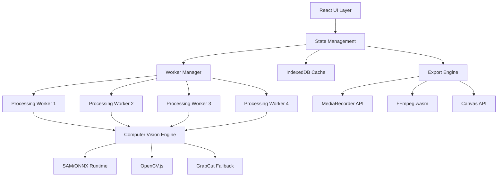

# Design Document

## Overview

The Object Tracking Matchcut Tool is a Progressive Web Application (PWA) built with React that processes images entirely client-side using WebAssembly and WebGPU technologies. The system employs a multi-stage pipeline combining computer vision algorithms (SAM, ORB, RANSAC) with modern web APIs to create professional matchcut sequences.

The architecture prioritizes performance through parallel processing, intelligent caching, and progressive enhancement with graceful fallbacks for different device capabilities.

## Architecture

### High-Level System Architecture



### Technology Stack

| Layer | Technology | Purpose | Size/Performance |
|-------|------------|---------|------------------|
| UI Framework | React 18 + Vite | Component-based UI with fast HMR | ~200KB |
| Styling | Tailwind CSS | Utility-first responsive design | ~50KB |
| State Management | Zustand | Lightweight global state | ~10KB |
| Segmentation | SAM (ONNX Runtime Web) | Primary object segmentation | 40MB, 2-5s/image |
| Fallback Segmentation | GrabCut (OpenCV.js) | Backup segmentation method | 8MB, 1-3s/image |
| Feature Detection | ORB (OpenCV.js) | Keypoint detection and matching | 100-200ms/image |
| Alignment | RANSAC + Affine | Geometric transformation | <50ms/image |
| Export | Canvas + MediaRecorder + FFmpeg | Multi-format output | Variable |
| Caching | IndexedDB | Model and project persistence | Unlimited |
| Workers | Web Workers API | Parallel processing | 4 concurrent threads |

## Components and Interfaces

### Core Components

#### 1. Application Shell (`App.tsx`)
- Main application container
- Route management and global error boundaries
- Progressive loading states
- Service worker registration

#### 2. Project Manager (`ProjectManager.tsx`)
- Image upload and validation
- Project state persistence
- Timeline visualization
- Export coordination

#### 3. Segmentation Engine (`SegmentationEngine.ts`)
```typescript
interface SegmentationEngine {
  loadModels(): Promise<void>;
  segmentObject(image: ImageData, bbox: BoundingBox): Promise<Mask>;
  predictMask(image: ImageData, previousBbox: BoundingBox): Promise<Mask>;
  validateMask(mask: Mask): MaskQuality;
}

interface Mask {
  data: Uint8Array;
  width: number;
  height: number;
  confidence: number;
  boundingBox: BoundingBox;
}
```

#### 4. Feature Matcher (`FeatureMatcher.ts`)
```typescript
interface FeatureMatcher {
  extractFeatures(image: ImageData, mask: Mask): Promise<FeatureSet>;
  matchFeatures(features1: FeatureSet, features2: FeatureSet): Promise<MatchResult>;
  computeTransform(matches: MatchResult): Promise<AffineTransform>;
}

interface FeatureSet {
  keypoints: KeyPoint[];
  descriptors: Float32Array;
  count: number;
}
```

#### 5. Alignment Engine (`AlignmentEngine.ts`)
```typescript
interface AlignmentEngine {
  alignFrames(frames: ProcessedFrame[]): Promise<AlignedFrame[]>;
  findMedianFrame(frames: ProcessedFrame[]): number;
  normalizeScale(frames: AlignedFrame[], targetHeight: number): Promise<AlignedFrame[]>;
  warpFrame(frame: ProcessedFrame, transform: AffineTransform): Promise<AlignedFrame>;
}
```

#### 6. Color Corrector (`ColorCorrector.ts`)
```typescript
interface ColorCorrector {
  extractColorStats(image: ImageData, mask: Mask): ColorStats;
  applyColorTransfer(image: ImageData, sourceStats: ColorStats, targetStats: ColorStats): Promise<ImageData>;
  adjustExposure(image: ImageData, evAdjustment: number): Promise<ImageData>;
}
```

#### 7. Frame Sequencer (`FrameSequencer.ts`)
```typescript
interface FrameSequencer {
  computeAngularDistances(frames: AlignedFrame[]): DistanceMatrix;
  orderFrames(frames: AlignedFrame[], referenceIndex: number): Promise<number[]>;
  validateSequence(orderedFrames: AlignedFrame[]): SequenceQuality;
}
```

#### 8. Export Engine (`ExportEngine.ts`)
```typescript
interface ExportEngine {
  exportWebM(frames: AlignedFrame[], settings: ExportSettings): Promise<Blob>;
  exportMP4(frames: AlignedFrame[], settings: ExportSettings): Promise<Blob>;
  exportPNGSequence(frames: AlignedFrame[]): Promise<Blob[]>;
  exportGIF(frames: AlignedFrame[], settings: ExportSettings): Promise<Blob>;
}
```

### Worker Architecture

#### Main Thread Responsibilities
- UI rendering and user interactions
- State management and coordination
- Progress reporting and error handling
- Final result assembly

#### Worker Thread Responsibilities
- Heavy computational tasks (segmentation, feature extraction)
- Image processing operations
- Model inference execution
- Intermediate result caching

```typescript
// Worker Message Interface
interface WorkerMessage {
  id: string;
  type: 'segment' | 'extract-features' | 'align' | 'color-correct';
  payload: any;
  transferables?: Transferable[];
}

interface WorkerResponse {
  id: string;
  success: boolean;
  result?: any;
  error?: string;
  progress?: number;
}
```

## Data Models

### Core Data Structures

```typescript
interface Project {
  id: string;
  name: string;
  createdAt: Date;
  updatedAt: Date;
  images: UploadedImage[];
  processedFrames: ProcessedFrame[];
  alignedFrames: AlignedFrame[];
  exportSettings: ExportSettings;
  processingState: ProcessingState;
}

interface UploadedImage {
  id: string;
  file: File;
  url: string;
  width: number;
  height: number;
  size: number;
  index: number;
}

interface ProcessedFrame {
  id: string;
  imageId: string;
  mask: Mask;
  features: FeatureSet;
  transform?: AffineTransform;
  colorStats: ColorStats;
  processingStatus: 'pending' | 'processing' | 'completed' | 'failed';
  errors: string[];
}

interface AlignedFrame {
  id: string;
  processedFrameId: string;
  alignedImage: ImageData;
  finalTransform: AffineTransform;
  rotationAngle: number;
  alignmentQuality: number;
  colorCorrected: boolean;
}

interface BoundingBox {
  x: number;
  y: number;
  width: number;
  height: number;
}

interface AffineTransform {
  matrix: Float64Array; // 2x3 transformation matrix
  rotation: number;
  scale: number;
  translation: { x: number; y: number };
}

interface ColorStats {
  meanR: number;
  meanG: number;
  meanB: number;
  stdR: number;
  stdG: number;
  stdB: number;
}

interface ExportSettings {
  format: 'webm' | 'mp4' | 'png' | 'gif';
  frameRate: number;
  frameDuration: number;
  quality: 'low' | 'medium' | 'high';
  transition: 'none' | 'crossfade';
  width?: number;
  height?: number;
}
```

### State Management Schema

```typescript
interface AppState {
  // Project Management
  currentProject: Project | null;
  projects: Project[];
  
  // Processing State
  isProcessing: boolean;
  processingProgress: ProcessingProgress;
  
  // UI State
  selectedFrameIndex: number;
  timelineView: 'grid' | 'linear';
  previewSettings: PreviewSettings;
  
  // System State
  modelsLoaded: boolean;
  systemCapabilities: SystemCapabilities;
  errorState: ErrorState | null;
}

interface ProcessingProgress {
  currentPhase: 'segmentation' | 'feature-extraction' | 'alignment' | 'color-correction' | 'ordering';
  completedFrames: number;
  totalFrames: number;
  estimatedTimeRemaining: number;
  currentOperation: string;
}

interface SystemCapabilities {
  webGPUSupported: boolean;
  webWorkersSupported: boolean;
  maxConcurrentWorkers: number;
  availableMemory: number;
  isMobile: boolean;
}
```

## Error Handling

### Error Classification and Recovery Strategies

#### Critical Errors (Block Progress)
1. **Model Loading Failures**
   - SAM model fails to load → Automatic fallback to GrabCut
   - OpenCV.js fails to load → Display error, suggest browser update
   - Recovery: Graceful degradation with user notification

2. **WebGPU/Hardware Failures**
   - WebGPU unavailable → Auto-fallback to WASM with performance warning
   - Insufficient memory → Reduce concurrent processing, suggest closing tabs
   - Recovery: Automatic capability detection and adaptation

3. **Insufficient Feature Matches**
   - <30 feature matches found → Flag frame, suggest retake/mask adjustment
   - Recovery: Manual intervention required, provide guidance

#### Warnings (Allow Continuation)
1. **Quality Issues**
   - Mask confidence <0.7 → Show quality indicator, allow refinement
   - <50 RANSAC inliers → Mark as "weak alignment", continue processing
   - Recovery: User can choose to proceed or refine

2. **Performance Issues**
   - Battery level <20% → Offer to pause processing
   - High memory usage → Suggest reducing concurrent frames
   - Recovery: User-controlled optimization

#### Error Recovery Mechanisms
```typescript
interface ErrorHandler {
  handleCriticalError(error: CriticalError): Promise<RecoveryAction>;
  handleWarning(warning: Warning): Promise<UserChoice>;
  suggestRecovery(error: ProcessingError): RecoveryStrategy[];
}

interface RecoveryStrategy {
  type: 'retry' | 'fallback' | 'skip' | 'manual-intervention';
  description: string;
  estimatedImpact: 'none' | 'quality-reduction' | 'performance-impact';
  autoApply: boolean;
}
```

## Testing Strategy

### Unit Testing
- **Component Testing**: React Testing Library for UI components
- **Algorithm Testing**: Jest for computer vision algorithms
- **Worker Testing**: Mock worker interfaces for parallel processing
- **State Testing**: Zustand store testing with mock data

### Integration Testing
- **Pipeline Testing**: End-to-end processing with sample images
- **Cross-browser Testing**: Chrome, Firefox, Safari, Edge compatibility
- **Performance Testing**: Benchmark processing times across device types
- **Memory Testing**: Monitor memory usage during large project processing

### Visual Regression Testing
- **UI Consistency**: Screenshot comparison for interface elements
- **Processing Results**: Compare output quality against reference images
- **Export Validation**: Verify exported files meet quality standards

### Performance Testing
```typescript
interface PerformanceMetrics {
  modelLoadTime: number;
  segmentationTimePerFrame: number;
  featureExtractionTime: number;
  alignmentTime: number;
  totalProcessingTime: number;
  memoryUsage: number;
  exportTime: Record<string, number>; // by format
}

interface PerformanceTest {
  deviceType: 'desktop' | 'mobile' | 'tablet';
  browserEngine: 'chromium' | 'webkit' | 'gecko';
  imageCount: number;
  imageResolution: string;
  expectedMetrics: PerformanceMetrics;
  tolerance: number;
}
```

### Test Data Management
- **Sample Images**: Curated dataset with various objects, lighting, angles
- **Edge Cases**: Low-texture objects, extreme lighting, motion blur
- **Performance Benchmarks**: Standardized test suites for different hardware tiers
- **Regression Tests**: Automated comparison against previous versions

### Continuous Integration
- **Automated Testing**: Run full test suite on every commit
- **Performance Monitoring**: Track performance regressions
- **Cross-platform Validation**: Test on multiple OS/browser combinations
- **Bundle Size Monitoring**: Ensure application stays within size limits

The testing strategy ensures reliability across diverse user environments while maintaining the performance targets specified in the requirements.